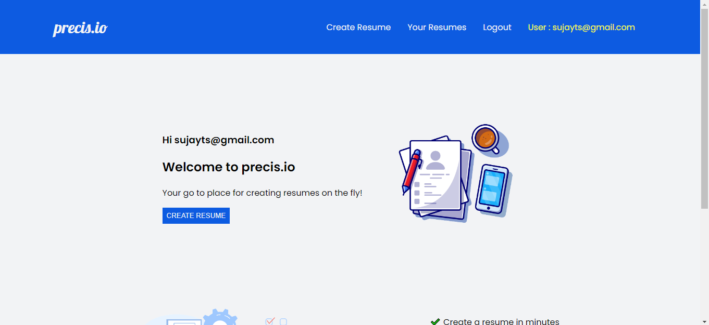
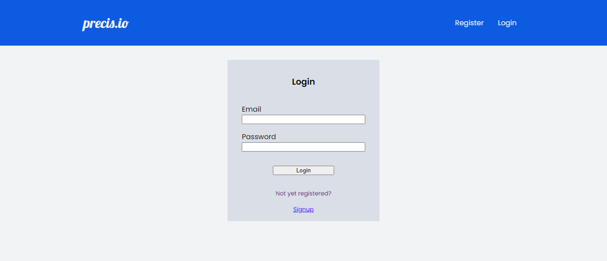
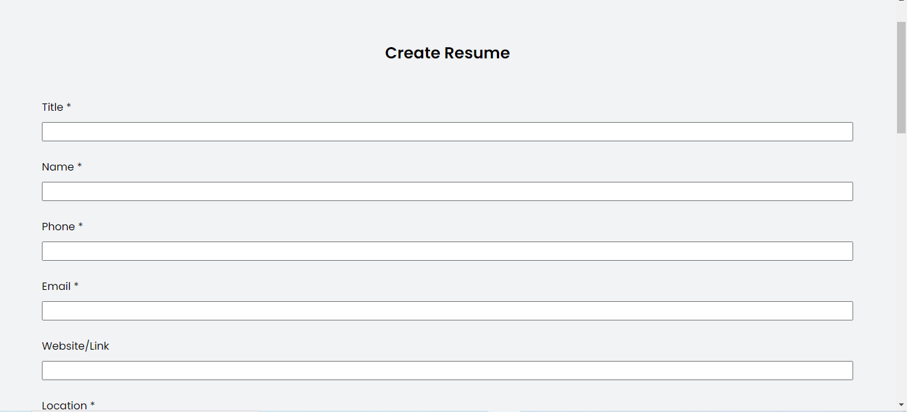
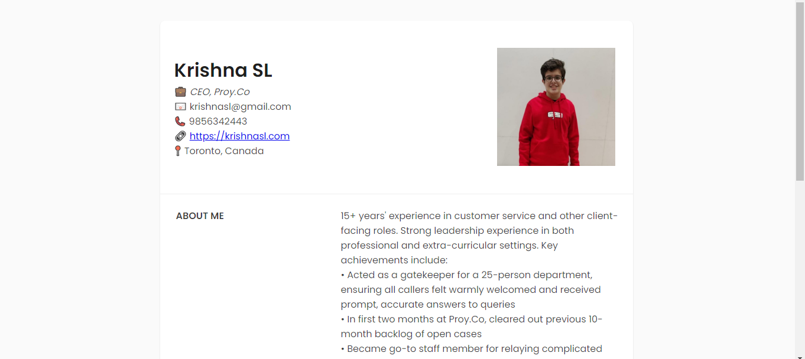
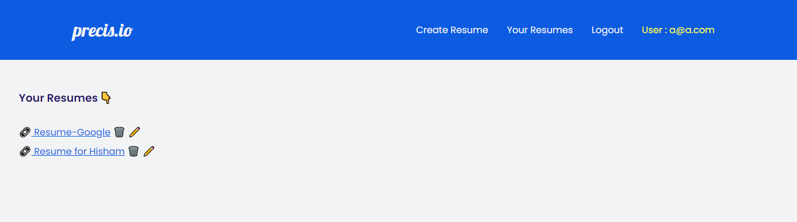

#  **_precis.io_** 

###  THE RESUME BUILDING WEB APPLICATION

"**_precis_**" is the easiest way to build a professional resume. This is the quick and easy way to create your professional Resume.

"**_precis_**" is the resume building website which can help you create your resume in no time. Just enter your required details and get the precise resume ready to leap in the carrier. The **_precis_** empowers you to easily create your job-winning online resume, showcase your academic publications.

**Create your resume using [precis.io]()** 

### FEATURES

- _precis.io_ takes you through every section of your resume,from the summary statement to the work experience and helps you create your resume in minutes.
- _precis.io_ helps you build professional resume for your job and store them in your dashboard.
- **Edit** your resumes whenever you want and **download** them in pdf format.
- Provides you a very user-friendly interface.
- Gets you a attractive and precise Resume.

 BEFORE YOU START BUILDING UP 

- List down the basic details you want to fill in your Resume
- A photo of yours if you wish to add in the Resume.
- A lot of enthusiasm to take a leap in your carrier.

STEPS TO CREATE YOUR ATTRACTIVE RESUME 

- 👉Register to the website through your email address

- 👇Log in to the website through your credentials

  

- 📚Go to create resume and fill the required details in the input form. Once you fill up all the required details,submit the resume.

- 👀Now you can view your created resume in the "_Your Resumes_" section of the website.

STEPS TO EDIT OR DELETE THE RESUME

- 📝Go to "_Your Resumes_" section of the website.

- ⬆️There you can see the Resumes which you have already created where in you have edit ✏️ to edit your resume and delete 🗑 to delete the Resume from your dashboard

A great job application leads to a good interview. An amazing resume is what makes it all possible. Start off strong with the hiring manager by creating a positive professional image. A job interview can be much easier if they have a favorable view of your resume.

### INFRASTRUCTURE

💡Backend : **_Python, django_**

💡Frontend : **_HTML, CSS_**

💡Adding Event Listeners : **_Javascript_**

💡Database : **_Postgres_**
